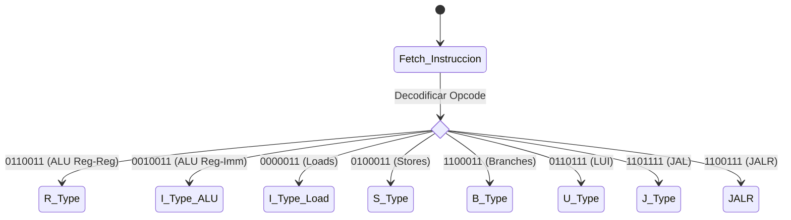

# Especificaciones del Set de Instrucciones RISC-V (RV32I) - Referencia Funcional

Este documento define la codificación y el comportamiento funcional (RTL) de las instrucciones implementadas en el procesador. El diseño sigue el estándar base **RV32I** de RISC-V.

### Notación y Leyenda
*   **R[reg]**: Contenido del registro `reg`.
*   **M[dir]**: Contenido de la memoria en la dirección `dir`.
*   **PC**: Program Counter (Contador de Programa).
*   **Imm**: Valor inmediato.
*   **SE(val)**: Extensión de signo (Sign-Extend).
*   **ZE(val)**: Extensión de ceros (Zero-Extend).
*   **&, |, ^, ~**: Operadores lógicos AND, OR, XOR y NOT.
*   **<<, >>**: Desplazamiento lógico (SLL, SRL).
*   **>>>**: Desplazamiento aritmético (SRA).

---

### Flujo de Ejecución Genérico
El siguiente diagrama describe cómo la unidad de control clasifica la instrucción para su ejecución:

---

## 1. Instrucciones Tipo-R (Registro-Registro)
Se utilizan para operaciones aritmético-lógicas entre dos registros de la RF.

**Estructura del Formato:**
| 31...25 | 24...20 | 19...15 | 14...12 | 11...7 | 6...0 |
|:---:|:---:|:---:|:---:|:---:|:---:|
| funct7 | rs2 | rs1 | funct3 | rd | opcode |

| Instrucción | funct7 | funct3 | Opcode | Descripción Funcional (RTL) |
| :--- | :---: | :---: | :---: | :--- |
| **add** | `0000000` | `000` | `0110011` | `R[rd] = R[rs1] + R[rs2]` |
| **sub** | `0100000` | `000` | `0110011` | `R[rd] = R[rs1] - R[rs2]` |
| **sll** | `0000000` | `001` | `0110011` | `R[rd] = R[rs1] << R[rs2][4:0]` |
| **slt** | `0000000` | `010` | `0110011` | `R[rd] = (R[rs1] < R[rs2]) ? 1 : 0` (Con signo) |
| **sltu**| `0000000` | `011` | `0110011` | `R[rd] = (R[rs1] < R[rs2]) ? 1 : 0` (Sin signo) |
| **xor** | `0000000` | `100` | `0110011` | `R[rd] = R[rs1] ^ R[rs2]` |
| **srl** | `0000000` | `101` | `0110011` | `R[rd] = R[rs1] >> R[rs2][4:0]` |
| **sra** | `0100000` | `101` | `0110011` | `R[rd] = R[rs1] >>> R[rs2][4:0]` |
| **or** | `0000000` | `110` | `0110011` | `R[rd] = R[rs1] \| R[rs2]` |
| **and** | `0000000` | `111` | `0110011` | `R[rd] = R[rs1] & R[rs2]` |

---

## 2. Instrucciones Tipo-I (Inmediato)
Se utilizan para operaciones con constantes, cargas de memoria y saltos indirectos.

**Estructura del Formato:**
| 31...20 | 19...15 | 14...12 | 11...7 | 6...0 |
|:---:|:---:|:---:|:---:|:---:|
| imm[11:0] | rs1 | funct3 | rd | opcode |

### 2.1 Aritmética con Inmediatos (Opcode: `0010011`)
| Instrucción | funct3 | Descripción Funcional (RTL) |
| :--- | :---: | :--- |
| **addi** | `000` | `R[rd] = R[rs1] + SE(imm)` |
| **slti** | `010` | `R[rd] = (R[rs1] < SE(imm)) ? 1 : 0` |
| **xori** | `100` | `R[rd] = R[rs1] ^ SE(imm)` |
| **ori** | `110` | `R[rd] = R[rs1] \| SE(imm)` |
| **andi** | `111` | `R[rd] = R[rs1] & SE(imm)` |

### 2.2 Cargas de Memoria (Opcode: `0000011`)
*Nota: La dirección efectiva es `R[rs1] + SE(imm)`.*

| Instrucción | funct3 | Descripción Funcional (RTL) |
| :--- | :---: | :--- |
| **lb** | `000` | `R[rd] = SE(M[Addr][7:0])` (Byte con signo) |
| **lh** | `001` | `R[rd] = SE(M[Addr][15:0])` (Half-word con signo) |
| **lw** | `010` | `R[rd] = M[Addr][31:0]` (Palabra completa) |
| **lbu**| `100` | `R[rd] = ZE(M[Addr][7:0])` (Byte sin signo) |
| **lhu**| `101` | `R[rd] = ZE(M[Addr][15:0])` (Half-word sin signo) |

---

## 3. Instrucciones Tipo-S (Store)
Almacenan el contenido de un registro en la memoria de datos.

**Estructura del Formato:**
| 31...25 | 24...20 | 19...15 | 14...12 | 11...7 | 6...0 |
|:---:|:---:|:---:|:---:|:---:|:---:|
| imm[11:5] | rs2 (src) | rs1 (base) | funct3 | imm[4:0] | opcode |

**Opcode:** `0100011`

| Instrucción | funct3 | Descripción Funcional (RTL) |
| :--- | :---: | :--- |
| **sb** | `000` | `M[R[rs1] + SE(imm)][7:0] = R[rs2][7:0]` |
| **sh** | `001` | `M[R[rs1] + SE(imm)][15:0] = R[rs2][15:0]` |
| **sw** | `010` | `M[R[rs1] + SE(imm)][31:0] = R[rs2][31:0]` |

---

## 4. Instrucciones Tipo-B (Branch)
Saltos condicionales basados en comparaciones. El inmediato representa un offset de 13 bits (múltiplo de 2).

**Opcode:** `1100011`

| Instrucción | funct3 | Descripción Funcional (RTL) |
| :--- | :---: | :--- |
| **beq** | `000` | `if (R[rs1] == R[rs2]) PC = PC + SE(imm)` |
| **bne** | `001` | `if (R[rs1] != R[rs2]) PC = PC + SE(imm)` |
| **blt** | `100` | `if (R[rs1] < R[rs2]) PC = PC + SE(imm)` |
| **bge** | `101` | `if (R[rs1] >= R[rs2]) PC = PC + SE(imm)` |

---

## 5. Instrucciones de Control de Salto (JAL / JALR)

| Instrucción | Tipo | Opcode | Descripción Funcional (RTL) |
| :--- | :---: | :---: | :--- |
| **jal** | J | `1101111` | `R[rd] = PC + 4; PC = PC + SE(imm)` |
| **jalr** | I | `1100111` | `R[rd] = PC + 4; PC = (R[rs1] + SE(imm)) & ~1` |

---

## 6. Instrucciones Especiales

### 6.1 Carga de Inmediato Superior (U-Type)
| Instrucción | Opcode | Descripción Funcional (RTL) |
| :--- | :---: | :--- |
| **lui** | `0110111` | `R[rd] = imm << 12` (Limpia los 12 bits bajos) |
| **auipc** | `0010111` | `R[rd] = PC + (imm << 12)` |

### 6.2 Sistema
| Instrucción | Opcode | Descripción Funcional (RTL) |
| :--- | :---: | :--- |
| **ecall** | `1110011` | Transfiere el control al sistema operativo / depurador (Trap). |
| **ebreak**| `1110011` | Punto de interrupción para depuración (Breakpoint). |
