# Especificación del Sistema de Cómputo Remoto RISC-V sobre FPGA

---

## Resumen del Sistema

Este documento especifica la infraestructura de **Comando y Control (C2)** y la integración a nivel de sistema (`riscv_fpga_top`) para la implementación del procesador RISC-V RV32I "Risky" en una FPGA (Digilent Basys 3).

El diseño opera como un sistema de cómputo (*tethered*), donde la FPGA actúa como un coprocesador que recibe código, datos y comandos de ejecución desde un Host (PC) a través de una interfaz UART. El sistema no posee un sistema operativo residente ni memoria flash de arranque; todo el software se inyecta volátilmente en cada sesión.

### Arquitectura de Top-Level
El módulo superior integra el Núcleo, el subsistema C2, la gestión de reloj y las memorias.

1.  **Gestión de Reloj (Clock Wiz):**
    *   Entrada: Oscilador de 100 MHz.
    *   Salida: Reloj de sistema de **50 MHz**.
    *   **Reset Seguro:** El sistema mantiene el reset lógico activo (`sys_rst_sys`) hasta que el PLL del reloj reporta estabilidad (`locked`). Esto evita condiciones de carrera durante el arranque.

2.  **Jerarquía de Memoria:**
    *   **Memoria de Instrucciones (IMEM):** Implementada mediante IP Core (Block RAM / Distributed RAM). Configurada para acceso de lectura por palabra (32-bits). Profundidad direccionable de 256 palabras (1 KB).
    *   **Memoria de Datos (DMEM):** Implementación personalizada (`data_memory.sv`). A diferencia de los IPs estándar que suelen operar con granularidad de *half-word* o *word*, este módulo permite **escritura por byte** (Byte-Addressable Write) mediante una máscara de escritura de 4 bits. Esto es crítico para soportar instrucciones `SB` (Store Byte) y `SH` (Store Half) nativas de RISC-V.

3.  **Arbitraje C2:**
    *   El subsistema C2 actúa como un "Traffic Cop". Monitorea la línea UART y, basándose en el comando recibido, despierta al módulo correspondiente (Loader o Debugger), otorgándole control exclusivo sobre los recursos compartidos (puerto TX UART y puertos de escritura de Memoria).

---

## UART Transceiver

Módulo encargado de la capa física de comunicación (PHY). Implementa un protocolo asíncrono **8N1** (8 bits de datos, No paridad, 1 bit de parada) a una velocidad configurable mediante `baud_selector_i` (9600, 19200, 57600, 115200 Baudios).

### Generador de Baudios
Utiliza un contador divisor de frecuencia basado en el reloj del sistema para generar un pulso de muestreo (`tick_16x`) a 16 veces la frecuencia de baudios objetivo. El divisor se ajusta dinámicamente según la entrada `baud_selector_i`:
- `00`: 9600 | `01`: 19200 | `10`: 57600 | `11`: 115200

> Nota: Para este trabajo se decidió congelar la tasa de baudios en 115200 por más de que el módulo sea parametrizable para evitar bugs inoportunos, y al considerar que en ningun caso se estimaría como más viable reducir la velocidad de transferencia.

### UART RX (Receptor)
Máquina de estados finitos que sobre-muestrea la entrada para filtrar ruido y detectar el bit de inicio. Implementa una lógica de sincronización de doble etapa para evitar metaestabilidad.

#### Máquina de Estados del Receptor (RX)

```mermaid
stateDiagram-v2
    state check_start <<choice>>
    state check_bit_idx <<choice>>
    state check_stop <<choice>>

    [*] --> S_IDLE
    S_IDLE --> S_START : rx_fall_edge (start_detect)
    
    S_START --> check_start : tick_16x && tick_cnt == 7
    check_start --> S_DATA : if rx == 0 (Valid Start)
    check_start --> S_IDLE : if rx == 1 (Glitch/Noise)

    S_DATA --> check_bit_idx : tick_16x && tick_cnt == 15
    check_bit_idx --> S_DATA : if bit_idx < 7
    check_bit_idx --> S_STOP : if bit_idx == 7

    S_STOP --> check_stop : tick_16x && tick_cnt == 15
    check_stop --> S_DONE : if rx == 1 (Valid Stop)
    check_stop --> S_IDLE : if rx == 0 (Framing Error)

    S_DONE --> S_IDLE : ready_o = 1
```

*   **Sincronización:** Doble flip-flop para mitigar metaestabilidad en la señal `rx_i`.
*   **Muestreo:** Toma el valor de la línea en el `tick` 7 del bit de inicio y cada 16 ticks subsiguientes para asegurar la captura en el centro de la ventana de estabilidad del bit.
*   **Interfaz:** Entrega el byte capturado en `data_o` y genera un pulso `ready_o` al completar una recepción válida.

### UART TX (Transmisor)
Registro de desplazamiento de salida que encapsula el dato paralelo en una trama serie.

#### Máquina de Estados del Transmisor (TX)

*   **Funcionamiento:** 
    1.  En `S_IDLE`, espera la señal `start_i`. 
    2.  En `S_START`, mantiene la línea en bajo por 16 ticks (bit de inicio).
    3.  En `S_DATA`, serializa el byte bit a bit (LSB first), manteniendo cada bit durante 16 ticks.
    4.  En `S_STOP`, envía un nivel alto (bit de parada) y activa `done_o`.
*   **Estado:** La señal `busy_o` permanece en alto desde que se inicia la transferencia hasta que el bit de parada finaliza.

### Especificaciones Técnicas

| Parámetro | Valor |
| :--- | :--- |
| **Data Bits** | 8 |
| **Paridad** | No |
| **Stop Bits** | 1 |
| **Oversampling** | 16x |
| **Orden de bits** | LSB First |
| **Reloj Base** | 50 MHz (Configurable por parámetro `CLK_FREQ`) |
|**Tasa de Transfderencia**| Configurable físicamente. En esta ocasión fue limitado a 115200 baudios.|

---

## C2 Arbiter (Central Command & Control)

El Árbitro es el cerebro del sistema de comunicación. Su función es decodificar el primer byte recibido (Comando Maestro) y establecer el flujo de datos hacia el sub-módulo apropiado, gestionando el multiplexado de los canales de transmisión UART.

### Diagrama de Estados del Árbitro

### Funciones Principales
1.  **Decodificación de Comandos:** En `S_IDLE`, el árbitro escucha el bus de datos RX. Si el byte coincide con un comando conocido (ej. `CMD_LOAD_CODE`), transiciona y configura los registros de control.
2.  **Handshake (ACK):** Antes de ceder el control, el árbitro hace un "eco" del comando recibido hacia el Host. Esto confirma la conexión y sincroniza al software remoto.
3.  **Gestión de Reset (Soft Reset):** Al finalizar cualquier operación (carga o sesión de debug), el árbitro emite un pulso de `soft_reset_o`. Esto limpia el Program Counter (PC), los registros del Pipeline y el Register File del núcleo, dejándolo listo para una nueva ejecución limpia desde cero.

---

## Loader Unit

Este módulo actúa como un motor de **Acceso Directo a Memoria (DMA)** simplificado. Su función principal es permitir la inyección de programas o datos desde una fuente externa (vía UART) directamente a las memorias del sistema, sin intervención del procesador. 

El Loader se encarga de recibir un flujo serial de bytes, reconstruir palabras de 32 bits y gestionarlas según el destino seleccionado por el Árbitro del sistema.

### Protocolo de Carga y Flujo de Datos

Para garantizar que los datos se escriban correctamente, el Loader implementa una máquina de estados (FSM) que sigue esta secuencia:

1.  **Handshake Inicial:** El módulo permanece en reposo (`S_IDLE`) hasta que recibe la señal `grant_i` del Árbitro. En este momento, inicializa el puntero de dirección a `0x00000000`.
2.  **Configuración del Tamaño (16 bits):** 
    *   Espera el primer byte (**High Byte**) que representa la parte alta de la cantidad de palabras a transferir.
    *   Espera el segundo byte (**Low Byte**) para completar el conteo total (`total_word_count`).
    *   *Nota: El tamaño se define en cantidad de palabras de 32 bits, no en bytes.*
3.  **Ensamblado de Palabras (Little Endian):** 
    *   Recibe 4 bytes consecutivos por cada palabra. 
    *   Sigue un esquema **Little Endian**: el primer byte recibido se almacena en los bits `[7:0]`, el segundo en `[15:8]`, y así sucesivamente.
4.  **Escritura en Memoria:** 
    *   Una vez completada la palabra de 32 bits, el módulo activa `mem_write_enable_o` durante un ciclo de reloj.
    *   La dirección de memoria (`mem_addr_o`) se incrementa automáticamente en **4** después de cada escritura exitosa.
5.  **Finalización y Feedback:** 
    *   Al procesar la última palabra, el módulo envía un byte de confirmación **ACK (`0xF1`)** a través del transmisor UART.
    *   Finalmente, activa la señal `done_o` para que el Árbitro libere el bus y el sistema pueda comenzar la ejecución.

### Selección de Objetivo (Target)
El destino de la escritura depende de la señal `target_select_i` controlada por el Árbitro:
*   **Target 0 (IMEM):** Escribe el flujo en la Memoria de Instrucciones (ideal para cargar el binario del programa).
*   **Target 1 (DMEM):** Escribe el flujo en la Memoria de Datos (ideal para cargar tablas o datos iniciales).

### Diagrama de Estados (FSM)

### Resumen de Señales Clave
| Señal | Dirección | Descripción |
| :--- | :--- | :--- |
| `rx_data_i` | Entrada | Byte recibido desde el módulo UART. |
| `mem_addr_o` | Salida | Dirección de 32 bits para la memoria destino. |
| `mem_data_o` | Salida | Palabra de 32 bits ya ensamblada. |
| `tx_data_o` | Salida | Byte de ACK (`0xF1`) enviado al finalizar. |
| `done_o` | Salida | Pulso que indica la finalización exitosa de la carga. |

---

## Debug Unit

El Debug Unit es el componente supervisor encargado de arbitrar el avance del pipeline del procesador. Actúa como un puente entre los comandos externos (vía UART/Arbiter) y el núcleo, permitiendo la ejecución controlada y la extracción de telemetría mediante el Dumping Unit.

### Señales de Interfaz
*   **Gestión de Control:** `grant_i` (habilitación del árbitro), `exec_mode_i` (0: Paso a paso, 1: Continuo), `done_o` (indicador de término de ejecución).
*   **Control del Núcleo:** `cpu_stall_o` (congela el pipeline), `core_halted_i` (detecta instrucción `EBREAK`/`ECALL` en Writeback).
*   **Interfaz de Dump:** `dump_trigger_o` (inicio), `dump_mem_mode_o` (0: Diferencial, 1: Rango), `dump_done_i` (fin de volcado).
*   **Comandos UART:** `rx_data_i` / `rx_ready_i` (para recibir el comando de avance `0xAE`).

> Nota: Hay un paralelismo directo entre los modos de Debug y Dump:
> - Si Debug está en modo Continuo, Dumping Unit estará en modo Rango.
> - Si Debug está en modo Paso a Paso, Dumping Unit estará en modo Diferencial/Husmear.

### Modos de Operación

1.  **Modo Continuo (`exec_mode_i = 1`):**
    *   **Ejecución:** Libera el procesador (`cpu_stall_o = 0`) para correr a velocidad de reloj.
    *   **Detección de Halt:** Monitorea `core_halted_i`. Al detectarse, activa el *stall* inmediatamente.
    *   **Volcado:** Dispara el **Dumping Unit** en modo **Rango** (`dump_mem_mode_o = 1`) para extraer el estado final completo. Una vez terminado el volcado, el módulo finaliza su ciclo de trabajo.

2.  **Modo Paso a Paso (`exec_mode_i = 0`):**
    *   **Estado de Espera:** Mantiene el CPU congelado (`cpu_stall_o = 1`) y espera el comando `0xAE` por UART.
    *   **Pulso de Ejecución:** Al recibir el comando, libera el *stall* por **exactamente un ciclo de reloj** (`S_STEP`), permitiendo el avance de una etapa en el pipeline.
    *   **Volcado Diferencial:** Tras el paso, dispara el **Dumping Unit** en modo **Diferencial** (`dump_mem_mode_o = 0`) para reportar solo los cambios en registros.
    *   **Verificación de Halt:** Después del volcado, verifica si la instrucción ejecutada fue un Halt. Si no lo es, regresa al estado de espera; de lo contrario, finaliza la ejecución.

---

### Diagrama de Estados (FSM)

---

## Dumping Unit (Serialización de Estado)

Este módulo implementa la observabilidad total del procesador mediante la captura y transmisión serializada (UART) del estado interno. Actúa como un convertidor paralelo-serie masivo que empaqueta registros, el pipeline completo y la memoria en un protocolo de flujo de bytes determinista.

### 1. Captura de Datos (Taps)
El módulo monitorea los buses internos sin interferir en el tiempo de ejecución del ciclo de instrucción (non-intrusive snooping):
*   **Register File:** Acceso a los 32 registros (GPR) mediante un puerto de lectura dedicado (`rf_dbg_addr_o`/`rf_dbg_data_i`).
*   **Pipeline Plano:** Captura 471 bits de estado distribuidos en las 4 etapas (IF/ID, ID/EX, EX/MEM, MEM/WB) y la unidad de riesgos (Hazard Unit).
*   **Snoop de Memoria:** Monitorea el bus de datos (`dmem`) para capturar escrituras en tiempo real y utiliza un *Memory Range Tracker* para definir límites de volcado masivo.

### 2. Protocolo de Transmisión
La transmisión se realiza en formato **Little-Endian** byte a byte. El paquete se divide en tres fases:

#### A. Cabecera (Header)
1.  **Dump Alert:** Envía el byte constante `0xDA`.
2.  **Modo:** Envía el byte de modo registrado (`0x00` para Paso/Diferencial, `0x01` para Continuo/Rango).

#### B. Sección Fija (Estado del Núcleo)
1.  **Registros (128 Bytes):** 32 registros de propósito general (``x0``-``x31``), 4 bytes cada uno.
2.  **Pipeline (76 Bytes):** Se envían 19 palabras de 32 bits que mapean el estado del procesador:
    *   **W0:** Estado de Hazards (16 bits de status + padding).
    *   **W1-W3:** IF/ID (PC, Instrucción, PC+4).
    *   **W4-W9:** ID/EX (Control, PC, RS1, RS2, Inmediato, Metadatos).
    *   **W10-W13:** EX/MEM (Control/Meta, PC, Store Data, ALU Out).
    *   **W14-W17:** MEM/WB (Control/Meta, PC, ALU Out, Read Data).
    *   **W18:** Padding final (`0x00000000`).

#### C. Sección Variable (Memoria)
Depende del modo seleccionado mediante `dump_mem_mode_i`:
*   **Modo Continuo (Range):** 
    1. Envía `Min_Addr` (4B).
    2. Envía `Max_Addr` (4B).
    3. Envía secuencialmente todos los datos entre ambos rangos.
*   **Modo Paso (Step/Diff):**
    1. Envía `Byte_Enable_Flag` (4B): Indica si hubo escritura en el ciclo actual y si fue a nivel de palabra, media palabra o byte (y cual).
    2. Si hubo escritura: Envía la dirección (`Addr`) (4B) y el dato escrito (`Data`) (4B). Si no, finaliza el paquete.

### 3. Máquina de Estados (FSM)
La FSM gestiona la secuenciación de bytes y la espera del periférico UART (`tx_done_i`).

---

## Protocolos de Comunicación

La comunicación de coordinación Host-FPGA se realiza mediante tramas de 8 bits. Las palabras de información como tal se realizan en formato Little Endian.

### Comandos Host -> FPGA (C2 Arbiter)

| Byte (Hex) | Mnemónico | Descripción |
| :--- | :--- | :--- |
| **0x1C** | `CMD_LOAD_CODE` | Solicita acceso para escribir en la Memoria de Instrucciones. |
| **0x1D** | `CMD_LOAD_DATA` | Solicita acceso para escribir en la Memoria de Datos. |
| **0xCE** | `CMD_CONT_EXEC` | Inicia ejecución continua hasta encontrar un `ECALL`. |
| **0xDE** | `CMD_DEBUG_EXEC` | Entra en modo Debug (Pausado) esperando comandos de paso. |

### Comandos Host -> FPGA (Debug Unit)

| Byte (Hex) | Mnemónico | Descripción |
| :--- | :--- | :--- |
| **0xAE** | `CMD_ADVANCE_EXEC` | Avanza un ciclo de reloj en modo Debug. |

### Respuestas FPGA -> Host

| Byte (Hex) | Mnemónico | Fuente | Descripción |
| :--- | :--- | :--- | :--- |
| **[CMD]** | *Echo* | Arbiter | El árbitro devuelve el mismo byte de comando recibido como ACK inicial. |
| **0xF1** | `ACK_FINISH` | Loader | Indica que la carga de memoria ha finalizado correctamente. |
| **0xDA** | `RSP_DUMP_ALERT` | Dumper | Cabecera que indica el inicio de un paquete de volcado de estado. |
